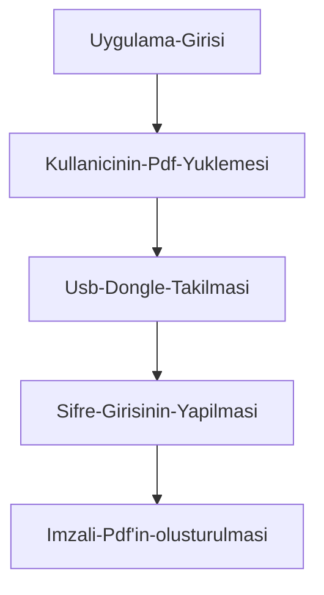

#  E-Imza-iTextSharp-KAMUSM-Api

ITextSharp kütüphanesi ile TÜBİTAK KamuSM ESYA API yardımıyla E-imza bilgileri alınarak PDF bilgilerinin imzalandığı Windows Forms uygulaması.

## Uygulama Akış Diyagramı



## İmzalanmış Pdf Çıktısı


## E-Imza Bilgisinin alınması.

```c#
SmartCardManager smartCardManager = SmartCardManager.getInstance();
var smartCardCertificate = smartCardManager.getSignatureCertificate(false,false);
var signer = smartCardManager.getSigner(request.DonglePassword, smartCardCertificate);
CERTIFICATE = smartCardCertificate.asX509Certificate2();
externalSignature = new SmartCardSignature(signer, CERTIFICATE, "SHA-256");
```
> **Not:** Burada kullanılan kod parçacığı **KamuSM'in SmardCardManager.cs** isimli sınıfından alınmıştır.

### Kaynaklar ;

[KamuSM ESYA API](https://yazilim.kamusm.gov.tr/esya-api/doku.php)

[iTextSharp API](https://developers.itextpdf.com/itext-5-examples)
